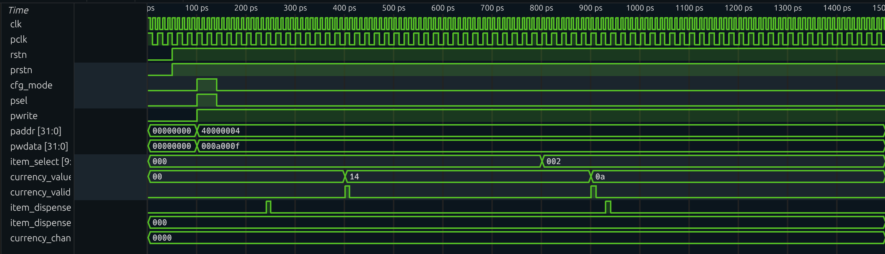

  <h1>🛒 Vending Machine Controller IP</h1>
  

    
    
    
    
  

  
<b>A high-performance RTL core featuring an APB configuration interface and an industry-standard UVM verification framework.</b>

---

### 📋 Technical Overview
This project implements a parameterizable Vending Machine Controller designed for modern SoC integration. It manages item inventory, calculates pricing, and handles multi-denomination currency with deterministic hardware timing.

### 🏗️ Architecture & Features
* **Dual-Clock Domain Support**: 
    * **System Clock (100MHz)**: Drives core FSM and currency logic.
    * **APB Clock (50MHz)**: Drives the configuration register bank.
* **APB Configuration Interface**: Allows runtime programming of prices and quantities for up to **1024 unique items**.
* **Deterministic Latency**: Guaranteed response time of **<10 system clock cycles** (<100ns) from final currency input to dispense.
* **Safety & Fault Recovery**: Automatically handles "Out-of-Stock" scenarios by returning a full refund and an error code (`0x3FF`).

---

### 📂 File Structure

| File Path | Role | Description |
| :--- | :--- | :--- |
| `rtl/common/vending_pkg.sv` | **Package** | Centralized definitions for parameters like `ITEM_ADDR_W` and `EMPTY_CODE`. |
| `rtl/vending_top.sv` | **Top Level** | Structural wrapper instantiating the FSM, Register Bank, and Input/Output controllers. |
| `dv/vending_if.sv` | **Interface** | The SystemVerilog interface bundling dual-clock signals for UVM connection. |
| `dv/env/` | **UVM Env** | (In Development) UVM Driver, Monitor, and Scoreboard classes for professional verification. |

---

### 🚦 Verification Roadmap (UVM Transition)
The project is currently transitioning to a professional **UVM (Universal Verification Methodology)** environment in **Siemens Questa**. This move replaces initial procedural testing with a robust, class-based architecture.

#### **Key Verification Objectives:**
1.  **Constrained Randomization**: Generating random currency sequences to test FSM robustness.
2.  **Functional Coverage**: Tracking which FSM states (IDLE, PROCESS, DISPENSE, REFUND) are exercised.
3.  **Self-Checking Scoreboard**: Automatically validating that `currency_chan` equals `inserted - price`.

<h3 align="center">🔍 Current Functional Trace</h3>

  
   
  <i>Initial waveform trace showing successful APB configuration and transaction math.</i>

---

  Developed by Pranav Kumar Atyam | Purdue University

